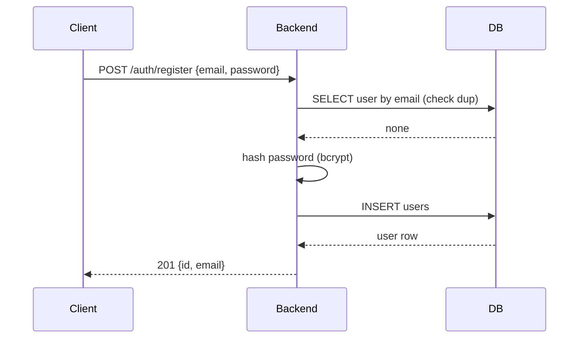
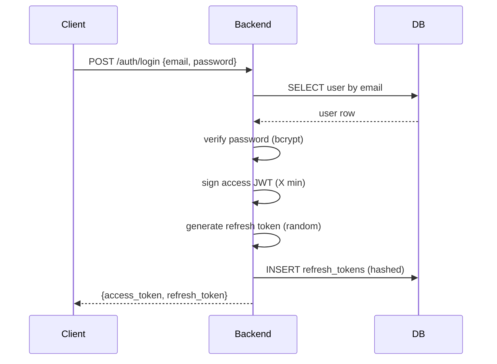
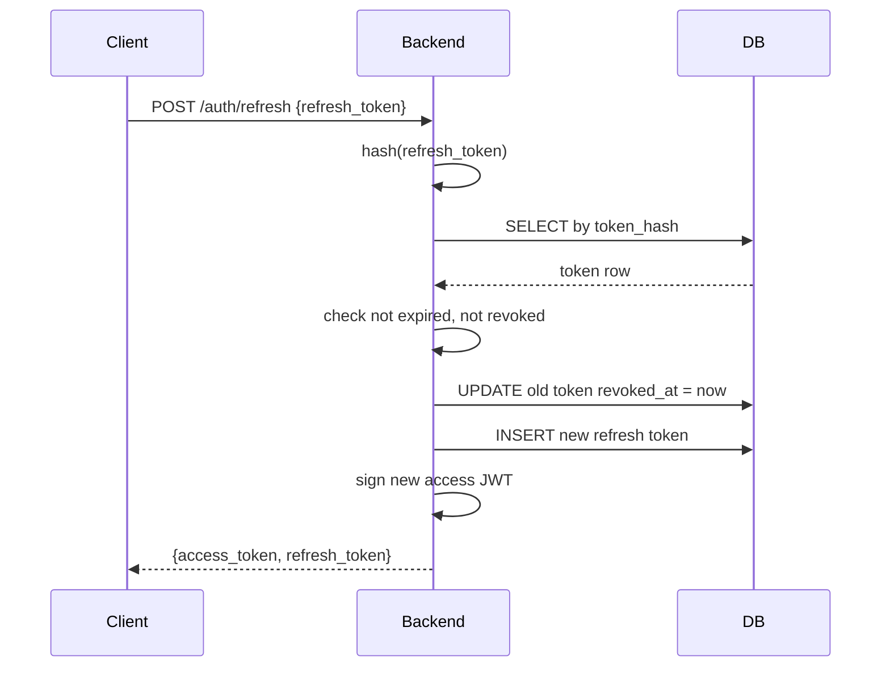

# Auth Design

## Register flow

```mermaid
sequenceDiagram
    participant C as Client
    participant A as Backend
    participant D as DB

    C->>A: POST /auth/register {email, password}
    A->>D: SELECT user by email (check dup)
    D-->>A: none
    A->>A: hash password (bcrypt)
    A->>D: INSERT users
    D-->>A: user row
    A-->>C: 201 {id, email}
```

## Login flow

```mermaid
sequenceDiagram
    participant C as Client
    participant A as Backend
    participant D as DB

    C->>A: POST /auth/login {email, password}
    A->>D: SELECT user by email
    D-->>A: user row
    A->>A: verify password (bcrypt)
    A->>A: sign access JWT (X min)
    A->>A: generate refresh token (random)
    A->>D: INSERT refresh_tokens (hashed)
    A-->>C: {access_token, refresh_token}
```

## Refresh flow

```mermaid
sequenceDiagram
    participant C as Client
    participant A as Backend
    participant D as DB

    C->>A: POST /auth/refresh {refresh_token}
    A->>A: hash(refresh_token)
    A->>D: SELECT by token_hash
    D-->>A: token row
    A->>A: check not expired, not revoked
    A->>D: UPDATE old token revoked_at = now
    A->>D: INSERT new refresh token
    A->>A: sign new access JWT
    A-->>C: {access_token, refresh_token}
```
